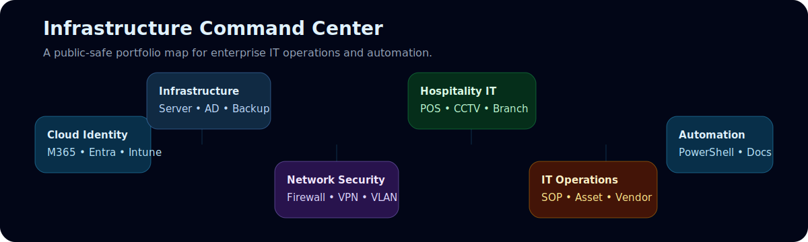
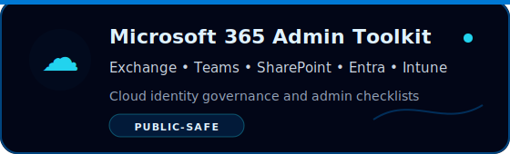
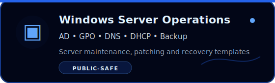
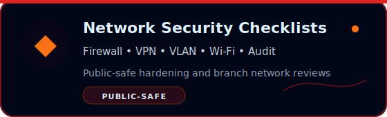
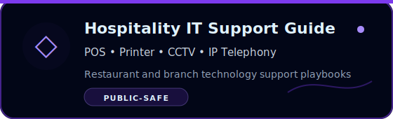
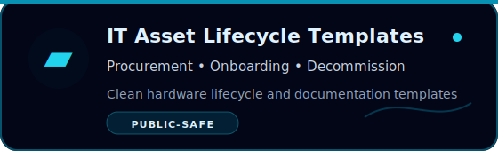
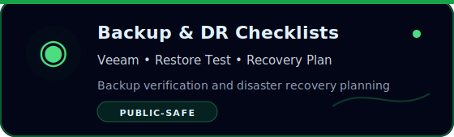
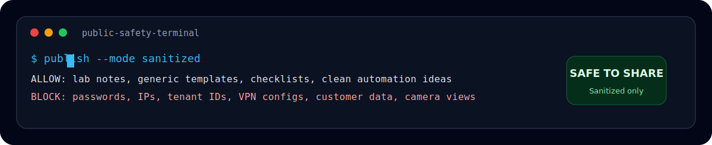

<!--
Creative GitHub Profile README - v2
Username: rizvansgtp-rgb
Safety: no phone number, passport number, visa number, internal IPs, tenant IDs,
VPN details, firewall configs, screenshots, customer data, vendor data, CCTV views,
credentials, tokens, private keys, or company-confidential material.
-->

<p align="center">
  
</p>

<p align="center">
  
</p>

<p align="center">
  <a href="https://www.linkedin.com/in/mohamed-rizvan-7185631b4">
    
  </a>
  <a href="https://github.com/rizvansgtp-rgb">
    
  </a>
  
</p>

<p align="center">
  
  
  
  
  
</p>


## 👋 Professional Snapshot

I build and support reliable IT environments for business operations: Microsoft 365, identity, endpoint management, Windows Server, firewall/VPN, network infrastructure, POS systems, CCTV platforms, vendor coordination, and IT documentation.

This GitHub profile is my **public-safe IT portfolio**. It is focused on reusable checklists, lab-friendly templates, operations playbooks, and automation notes — without exposing confidential business, customer, tenant, firewall, VPN, CCTV, POS, or identity data.

<p align="center">
  
</p>

## ⚙️ Expertise Matrix

<table>
  <tr>
    <td width="33%" valign="top">
      <h3>☁️ Cloud & Identity</h3>
      <p>Microsoft 365, Exchange Online, Teams, SharePoint, Entra ID, Intune, MFA, Conditional Access concepts, user lifecycle and secure collaboration.</p>
    </td>
    <td width="33%" valign="top">
      <h3>🖥️ Infrastructure</h3>
      <p>Windows Server, Active Directory, Group Policy, DNS, DHCP, file services, patching, backups, restore testing, documentation and monitoring.</p>
    </td>
    <td width="33%" valign="top">
      <h3>🔐 Network Security</h3>
      <p>FortiGate, SonicWall, Cisco routing/switching, LAN, WAN, VLAN, SSL VPN, site-to-site VPN concepts, firewall audit checklists and segmentation notes.</p>
    </td>
  </tr>
  <tr>
    <td width="33%" valign="top">
      <h3>🍽️ Hospitality IT</h3>
      <p>Oracle Symphony POS, SQL-based POS/backoffice workflows, branch IT support, kitchen/restaurant technology, printers, IP telephony and vendor support.</p>
    </td>
    <td width="33%" valign="top">
      <h3>📹 Physical Security IT</h3>
      <p>CCTV infrastructure concepts, NVR/DVR administration practices, health checks, uptime tracking and safe documentation without camera views or live footage.</p>
    </td>
    <td width="33%" valign="top">
      <h3>📊 IT Operations</h3>
      <p>Asset lifecycle, procurement support, onboarding/decommissioning checklists, SOPs, service continuity, incident notes and repeatable admin workflows.</p>
    </td>
  </tr>
</table>

## 🧰 Technical Stack

<p align="center">
  
  
  
  
  
  
  
  
  
  
  
  
  
  
  
  
</p>


## 📂 Portfolio Tracks

These are the public-safe repositories I am building to turn daily IT operations into reusable templates, scripts, and checklists.

<table>
  <tr>
    <td width="50%"><a href="https://github.com/rizvansgtp-rgb/m365-admin-toolkit"></a></td>
    <td width="50%"><a href="https://github.com/rizvansgtp-rgb/windows-server-operations"></a></td>
  </tr>
  <tr>
    <td width="50%"><a href="https://github.com/rizvansgtp-rgb/network-security-checklists"></a></td>
    <td width="50%"><a href="https://github.com/rizvansgtp-rgb/hospitality-it-support-guide"></a></td>
  </tr>
  <tr>
    <td width="50%"><a href="https://github.com/rizvansgtp-rgb/it-asset-lifecycle-templates"></a></td>
    <td width="50%"><a href="https://github.com/rizvansgtp-rgb/backup-dr-checklists"></a></td>
  </tr>
</table>

> Repository links may show 404 until each portfolio repository is created. Create them one by one, add sanitized content, then pin the best six to the profile.

## 🧪 Current Public Work

| Area | Public direction |
|---|---|
| POS / Restaurant Systems | Public exploration around restaurant POS and table management systems. |
| Profile Engineering | Creative GitHub README, SVG banner design, public-safe portfolio structure. |
| Infrastructure Documentation | Building reusable templates for Microsoft 365, server, network, security and operations work. |

## 🛡️ Public Sharing Policy

<p align="center">
  
</p>

<details>
  <summary><b>Open the full public safety rulebook</b></summary>

### ✅ Safe to publish

- Generic IT checklists
- Lab examples and learning notes
- Sanitized documentation templates
- Public-safe architecture patterns
- Automation ideas without tenant, customer, user, or company data
- Example commands using placeholders only

### ❌ Never publish

- Passwords, tokens, API keys, OTPs, certificates, or private keys
- Internal IP ranges, firewall rules, VPN configurations, PSKs, or public IPs
- Tenant IDs, domain names, user exports, device exports, or admin portal screenshots
- Customer data, employee data, invoices, contracts, asset serial numbers, IMEI numbers, or vendor details
- CCTV screenshots, NVR/DVR information, branch diagrams, live incidents, or real site names

</details>

## 🎓 Certifications & Development

<p align="center">
  
  
  
</p>

## 🧭 Learning Roadmap

```text
Microsoft 365 Security     -> identity protection, MFA, conditional access, secure collaboration
Endpoint Management        -> Intune baselines, compliance, device lifecycle and reporting
Network Security           -> firewall hardening, VPN governance, segmentation and audits
IT Documentation           -> SOPs, diagrams, asset lifecycle, knowledge base templates
Automation                 -> PowerShell, repeatable admin tasks, reporting and cleanup scripts
```

## 📈 GitHub Signals

<p align="center">
  
  
</p>

<p align="center">
  
</p>

## 🤝 Connect

<p align="center">
  <a href="https://www.linkedin.com/in/mohamed-rizvan-7185631b4">
    
  </a>
</p>

<p align="center">
  
</p>
