<p align="center">
  
</p>

<h1 align="center">Mohamed Rizvan Muthalif</h1>

<h3 align="center">
  Senior IT Infrastructure Engineer | Microsoft 365 Administrator | POS & Hospitality IT Specialist
</h3>

<p align="center">
  <a href="https://www.linkedin.com/in/mohamed-rizvan-7185631b4">
    
  </a>
  <a href="https://github.com/rizvansgtp-rgb">
    
  </a>
</p>

<p align="center">
  
</p>

---

## Professional Focus

I design, secure, and support enterprise IT infrastructure for multi-site business environments, with a strong focus on Microsoft 365, identity management, endpoint management, network security, firewall and VPN operations, Windows Server administration, POS systems, CCTV infrastructure, and IT service continuity.

My public GitHub profile is used to share sanitized IT documentation, reusable checklists, operational templates, and automation-friendly notes that help IT teams standardize support, security, and infrastructure management.

---

## Core Technology Areas

<table>
  <tr>
    <td><b>Cloud and Identity</b></td>
    <td>Microsoft 365, Exchange Online, Microsoft Teams, SharePoint Online, Microsoft Entra ID, Intune</td>
  </tr>
  <tr>
    <td><b>Infrastructure</b></td>
    <td>Windows Server, Active Directory, Group Policy, DNS, DHCP, DFS File Server, Backup and Recovery</td>
  </tr>
  <tr>
    <td><b>Networking and Security</b></td>
    <td>FortiGate, SonicWall, Cisco Routing and Switching, LAN, WAN, VLAN, Site-to-Site VPN, SSL VPN</td>
  </tr>
  <tr>
    <td><b>Hospitality IT</b></td>
    <td>Oracle Symphony POS, SQL-based POS, CCTV, IP Telephony, Branch IT Support, Vendor Coordination</td>
  </tr>
  <tr>
    <td><b>Operations</b></td>
    <td>IT Asset Lifecycle, Procurement, Documentation, Monitoring, Patch Management, Incident Support</td>
  </tr>
</table>

---

## Technical Stack

<p align="center">
  
  
  
  
  
  
  
  
  
  
  
  
</p>

---

## Featured Portfolio Repositories

Create these repositories and pin the best six to your GitHub profile.

| Repository | Purpose | Public Safety Rule |
|---|---|---|
| [`m365-admin-toolkit`](https://github.com/rizvansgtp-rgb/m365-admin-toolkit) | Microsoft 365 admin checklists, Exchange Online notes, Teams governance, Intune baseline ideas | No tenant IDs, user lists, real screenshots, or policy exports |
| [`windows-server-operations`](https://github.com/rizvansgtp-rgb/windows-server-operations) | AD, GPO, DNS, DHCP, backup, patching, and server maintenance documentation | No domain names, internal IPs, server names, or backup paths |
| [`network-security-checklists`](https://github.com/rizvansgtp-rgb/network-security-checklists) | Firewall, VPN, VLAN, Wi-Fi, and branch network audit checklists | No firewall configs, public IPs, VPN PSKs, diagrams, or serial numbers |
| [`hospitality-it-support-guide`](https://github.com/rizvansgtp-rgb/hospitality-it-support-guide) | POS, printer, CCTV, IP telephony, and branch support playbooks | No outlet names, camera views, POS credentials, vendor contacts, or live incidents |
| [`it-asset-lifecycle-templates`](https://github.com/rizvansgtp-rgb/it-asset-lifecycle-templates) | Asset register templates, procurement flow, onboarding and decommissioning checklists | No supplier invoices, asset tags, IMEI numbers, or user ownership data |
| [`backup-dr-checklists`](https://github.com/rizvansgtp-rgb/backup-dr-checklists) | Backup verification, restore testing, and disaster recovery planning templates | No real backup locations, encryption keys, retention policies, or restore targets |

---

## Public Sharing Policy

I only publish sanitized, reusable, and non-confidential material.

```text
Allowed:
- Generic checklists
- Lab examples
- Sanitized documentation templates
- Learning notes
- Publicly safe architecture patterns
- Automation ideas without customer or company data

Not allowed:
- Passwords, tokens, API keys, OTPs, certificates, or private keys
- Internal IP ranges, firewall rules, VPN configurations, or PSKs
- Tenant IDs, domain names, user exports, or admin portal screenshots
- Customer data, employee data, vendor contracts, invoices, or asset serial numbers
- CCTV screenshots, NVR/DVR details, branch diagrams, or live incident records
```

---

## Certifications

- Microsoft 365 Certified: Fundamentals
- Microsoft Dynamics 365 Business Central Functional Training
- Cisco Certified Network Associate

---

## Current Learning Roadmap

```text
Microsoft 365 Security        Identity, Conditional Access, secure collaboration
Endpoint Management           Intune baselines, compliance, device lifecycle
Network Security              Firewall hardening, VPN governance, segmentation
IT Documentation              SOPs, diagrams, asset lifecycle, support playbooks
Automation                    PowerShell, repeatable admin tasks, reporting
```

---

## Profile Direction

This GitHub profile is being built as a professional IT infrastructure portfolio, focused on secure operations, clear documentation, and practical systems administration for enterprise and hospitality environments.

<p align="center">
  <b>Standardize. Secure. Automate. Support.</b>
</p>

<!--
Optional GitHub stats section:
Add this only after you have created a few public repositories.
Replace rizvansgtp-rgb first.

<p align="center">
  
</p>
-->
